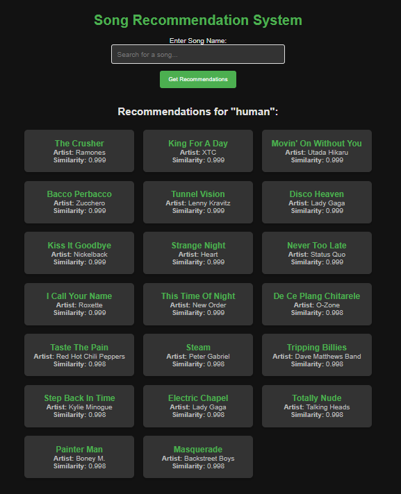

# 🎵 Song Recommendation System

A deep learning-based **unsupervised song recommendation engine** that transforms audio features into neural embeddings using an **autoencoder**, and then clusters them using **KMeans** to discover hidden structure in music preferences. This project is designed to analyze the musical landscape and group similar tracks, enabling recommendation, playlist creation, or music discovery.



---

## 🚀 Features

* 🔍 **Dimensionality Reduction** via a deep autoencoder
* 🎯 **Clustering** of latent features using KMeans
* 📊 **Visualization** of musical clusters in latent space
* 🎵 **Preprocessed Audio Feature Input** (tempo, energy, loudness, etc.)
* 🖼️ Flask-based interactive UI for music exploration
  .png)

---

## 🧠 Technical Architecture

### **1. Data Preprocessing**

* Input dataset: `../data/preprocess.csv`
* Selected Features:

  ```
  variance, Tempo, Loudness, Explicit, Popularity,
  Energy, Danceability, Positiveness, Speechiness,
  Liveness, Acousticness, Instrumentalness
  ```
* Features are standardized using `StandardScaler`.

---

### **2. Deep Autoencoder Model**

* **Input dimension:** 12
* **Latent (embedding) dimension:** 6
* **Architecture:**

  * Input → Dense(12, relu) → Dense(6, relu) → Dense(12, relu) → Output(12, linear)
* **Loss Function:** Mean Squared Error (MSE)
* **Optimizer:** Adam
* **Training:**

  * `Epochs`: 20
  * `Batch Size`: 32
  * `Validation Split`: 10%

#### ✅ **Performance Metrics**

* Final **Reconstruction MSE**: `0.1217`
* Training Loss: `0.1218`
* Validation Loss: `0.1190`

> Since this is an unsupervised model, standard classification accuracy is not applicable. However, **MSE** is used to gauge reconstruction quality.

---

### **3. Clustering**

* Encoded data from autoencoder is clustered using `KMeans(n_clusters=10)`
* Each song is assigned a **cluster label** representing a group of musically similar tracks.

---

### **4. Visualization**

* A 2D scatter plot of the latent space is created with cluster coloring:
  

---

## 🧾 Dataset

The dataset should be saved as:

```
../data/preprocess.csv
```

### 📌 Required Columns:

* `variance`, `Tempo`, `Loudness`, `Explicit`, `Popularity`
* `Energy`, `Danceability`, `Positiveness`, `Speechiness`
* `Liveness`, `Acousticness`, `Instrumentalness`

---

## 🎵 **Genre-Emotion to Features Mapping**

| Genre       | Emotion(s)                | Energy | Danceability | Positiveness | Speechiness | Liveness | Acousticness | Instrumentalness |
| ----------- | ------------------------- | ------ | ------------ | ------------ | ----------- | -------- | ------------ | ---------------- |
| Pop         | joy, love, sadness        | High   | High         | High         | Medium      | Low      | Medium       | Low              |
| Rock        | joy, anger, love          | High   | Medium       | Medium       | Low         | Medium   | Medium       | Low              |
| Hip Hop     | anger, joy, love          | High   | Medium       | Medium       | High        | Low      | Low          | Low              |
| Indie       | sadness, love, joy        | Medium | High         | Medium       | Low         | Medium   | High         | Low              |
| Dance       | joy, love, excitement     | High   | High         | High         | Low         | Low      | Low          | Low              |
| Rap         | anger, pride, confidence  | High   | Medium       | Low          | High        | Low      | Low          | Low              |
| R\&B        | love, sadness, desire     | Medium | Medium       | Medium       | High        | Low      | Low          | Low              |
| Electronic  | joy, energy, excitement   | High   | High         | High         | Medium      | Low      | Low          | Low              |
| Soul        | love, nostalgia           | Low    | Low          | Medium       | Low         | High     | High         | Low              |
| Alternative | sadness, melancholy       | Medium | Medium       | Medium       | Medium      | Low      | High         | Medium           |
| Metal       | anger, despair            | High   | Low          | Low          | Low         | Low      | Low          | High             |
| Classical   | awe, peace, sadness       | Low    | Low          | Low          | Low         | High     | High         | Low              |
| Jazz        | calm, contentment         | Low    | Low          | Medium       | Low         | High     | High         | Medium           |
| Country     | heartbreak, reflection    | Medium | Medium       | Medium       | Low         | Low      | High         | Low              |
| Folk        | thoughtfulness, nostalgia | Low    | Low          | Medium       | Low         | High     | High         | Low              |

---

## 🛠️ Requirements

| Tool         | Version |
| ------------ | ------- |
| Python       | 3.11.9  |
| pip          | 24.0    |
| TensorFlow   | 2.x     |
| scikit-learn | latest  |
| pandas       | latest  |
| numpy        | latest  |
| matplotlib   | latest  |

Install via:

```bash
pip install tensorflow scikit-learn pandas numpy matplotlib
```

---

## 📊 Usage

Run the project script to train and visualize:

```bash
python main.py
```

### Script Flow:

* ✅ Train the autoencoder on audio features
* 🧠 Extract latent embeddings
* 🔁 Perform KMeans clustering
* 📈 Visualize cluster distribution

---

## 📈 Output

* 📍 Cluster assignments saved to the dataset
* 🎨 Visual 2D scatter plot of latent song clusters
* 🌐 Flask UI for exploring clusters (optional image outputs above)

---

## 🧩 Potential Improvements

* 🔌 Add RESTful API for track lookup and cluster-based recommendations
* 🎧 Integrate with Spotify API for real-time track data
* 📉 Apply t-SNE or UMAP for higher-fidelity dimensionality reduction and plotting
* 🗂️ Build personalized playlists from user-cluster interactions

 