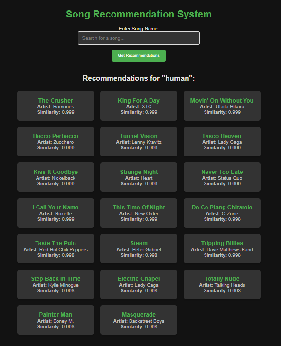

🎵 Song Recommendation System
This project builds an unsupervised learning-based song recommendation system using neural embeddings and clustering. It leverages an autoencoder to reduce high-dimensional song features into a latent space, followed by KMeans clustering to group similar songs.

🚀 Features
Dimensionality Reduction using a neural autoencoder

Unsupervised Clustering with KMeans

Visual Cluster Exploration with Matplotlib

Preprocessed Audio Feature Input (e.g., tempo, energy, danceability)
.png>)
🧠 Architecture Overview
Data Preprocessing: Standardization of numerical features.

Autoencoder:

Compresses 12 input features to a 6-dimensional latent space.

Reconstructs input for unsupervised learning using MSE loss.

Clustering:

Encoded features are clustered using KMeans (10 clusters).

Visualization:

2D scatter plot of latent space with color-coded clusters.

🧾 Dataset
The model expects a CSV file located at:

bash
Copy
Edit
../data/preprocess.csv
Required Columns:
variance, Tempo, Loudness, Explicit, Popularity

Energy, Danceability, Positiveness, Speechiness

Liveness, Acousticness, Instrumentalness

🛠️ Requirements
Python 3.7+

TensorFlow 2.x

scikit-learn

pandas

numpy

matplotlib

Install dependencies:

bash
Copy
Edit
pip install tensorflow scikit-learn pandas numpy matplotlib
📊 Usage
Run the main script to:

Train the autoencoder

Encode and cluster the song data

Visualize the results

bash
Copy
Edit
python main.py
📈 Output
A scatter plot of the clustered latent space.

Cluster labels added to the original dataset for further use (e.g., recommendation logic).

🧩 Potential Improvements
Add a song lookup and recommendation API

Integrate with Spotify API for dynamic feature retrieval

Use t-SNE or UMAP for better 2D visualization